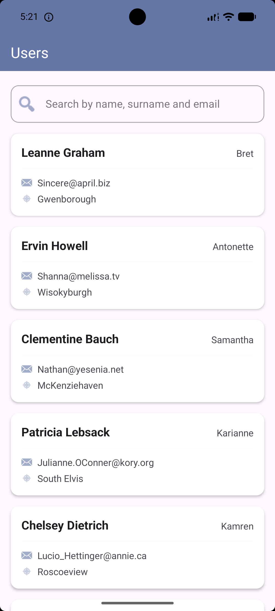
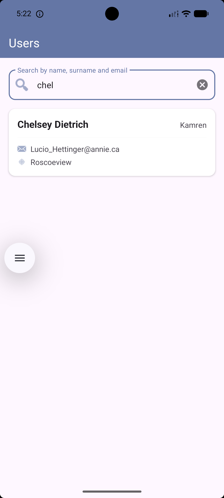
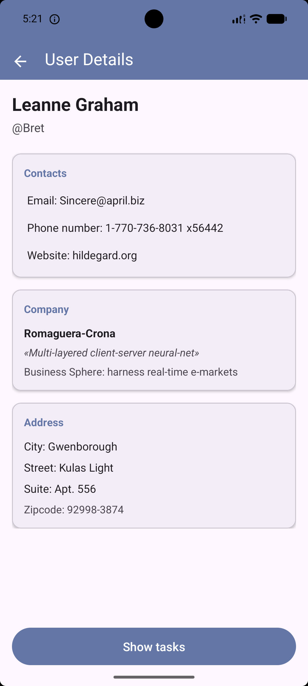
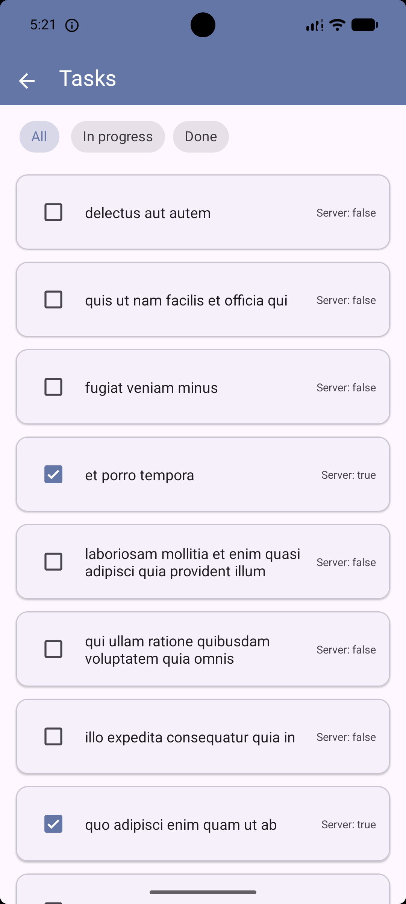
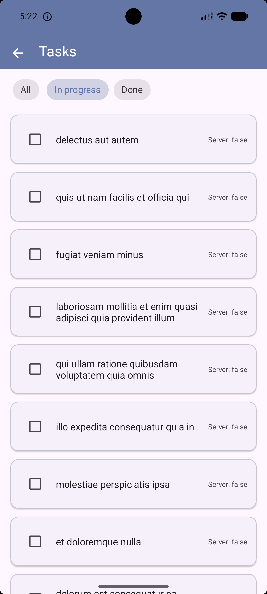
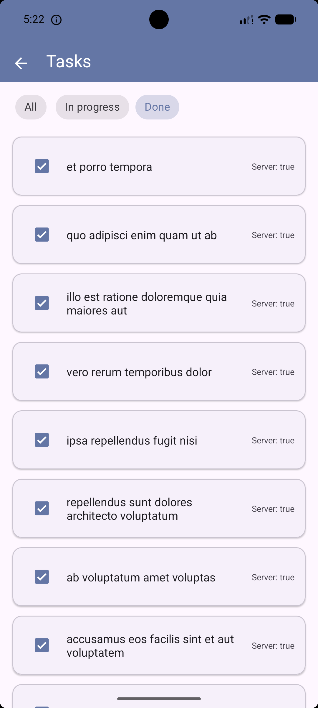

# Tasks

## Архитектура

Проект построен по **Clean Architecture** с разделением на три слоя: `Data → Domain → Presentation`. Паттерн — **MVVM**.

```
app/
├── data/
│   ├── api/          # Retrofit-сервисы, DTO-модели
│   ├── model/          # DTO-модели
│   └── repository/      # Реализации репозиториев
├── di/                  # Koin модули для иньекций зависимостей
├── domain/
│   ├── model/           # Доменные модели
│   ├── repository/      # Интерфейсы репозиториев
├── ui/
│    ├── userList/           # Экран списка пользователей
│    ├── userDetails/         # Экран деталей пользователя
│    └── todoList/           # Экран задач
└── utils/               # Вспомогательные функции
```

### Локальное состояние задач

Сервер не поддерживает изменения, поэтому изменённые статусы задач хранятся в StateFlow внутри синглтон-репозитория (TodoRepository), который живёт в Koin-контейнере как single { }. При первой загрузке экрана задач серверный completed копируется в локальный Map<Int, Boolean>. Последующие переключения меняют только эту карту — никаких сетевых запросов.

## Функционал

**Экран пользователей**
- Загрузка списка с обработкой LCE-состояний (Loading / Content / Error)
- Кнопка "Повторить" при ошибке сети
- Динамический поиск по имени, username и email

**Экран деталей**
- Полная информация пользователя: имя, контакты, компания, адрес, сайт
- Переход к списку задач пользователя

**Экран задач**
- Синхронизация серверного completed с локальным состоянием при первом открытии
- Переключение статуса каждой задачи («В работе» / «Выполнено») без сетевых запросов
- Фильтрация: Все / В работе / Выполнено


## Запуск

```bash
git clone https://github.com/erazero1/Tasks.git
```

1. Открыть проект в **Android Studio**
2. Дождаться синхронизации Gradle
3. Запустить на эмуляторе или устройстве с Android 7.0+ (API 24+)

## Скриншоты

## Скриншоты

<table>
  <tr>
    <td></td>
    <td></td>
    <td></td>
  </tr>
  <tr>
    <td></td>
    <td></td>
    <td></td>
  </tr>
</table>